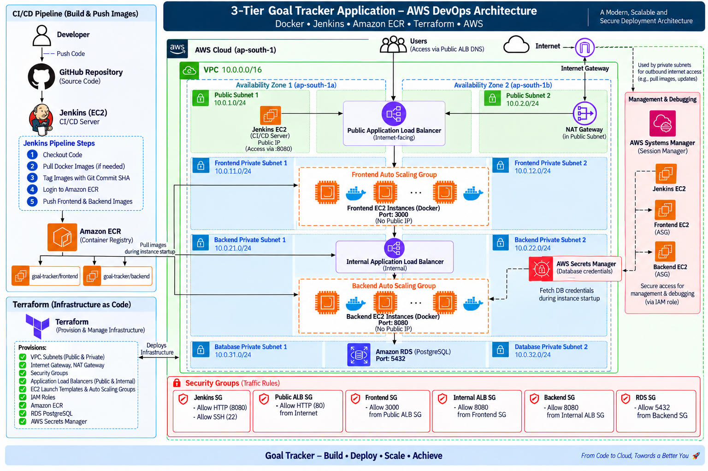

# 🚀 3-Tier Goal Tracker Application – AWS DevOps Platform

> A production-style 3-tier application deployment platform built with Docker, Jenkins, Amazon ECR, Terraform, EC2 Auto Scaling, Application Load Balancers, RDS PostgreSQL, AWS Secrets Manager, and AWS Systems Manager.

---

## 📌 Project Overview

This project demonstrates the deployment of a containerized 3-tier application on AWS using Infrastructure as Code and CI/CD practices.

The application consists of:

- **Frontend** – Node.js application running inside Docker
- **Backend** – Go application running inside Docker
- **Database** – PostgreSQL on Amazon RDS

The AWS infrastructure is provisioned and managed using **Terraform**, while **Jenkins** automates the container image publishing workflow to **Amazon ECR**.

The application runs across multiple Availability Zones, with the frontend, backend, and database tiers isolated inside private subnets.

---

## 🏗️ Architecture



### Application Request Flow

```text
Users
   │
   ▼
Public Application Load Balancer
   │
   ▼
Frontend Auto Scaling Group
   │
   │ Port 3000
   ▼
Internal Application Load Balancer
   │
   ▼
Backend Auto Scaling Group
   │
   │ Port 8080
   ▼
Amazon RDS PostgreSQL
   │
   │ Port 5432
```

### CI/CD Flow

```text
Developer
    │
    ▼
GitHub
    │
    ▼
Jenkins
    │
    ├── Checkout Code
    ├── Pull Docker Images
    ├── Tag Images with Git Commit SHA
    ├── Login to Amazon ECR
    └── Push Frontend & Backend Images
                 │
                 ▼
            Amazon ECR
             /       \
            ▼         ▼
       Frontend     Backend
        Image        Image
```

---

# 🧰 Technology Stack

### Cloud & Infrastructure

- AWS
- Amazon VPC
- Amazon EC2
- EC2 Auto Scaling Groups
- Application Load Balancer
- Amazon ECR
- Amazon RDS PostgreSQL
- AWS Secrets Manager
- AWS Systems Manager
- Internet Gateway
- NAT Gateway
- Security Groups
- IAM

### DevOps

- Terraform
- Jenkins
- Docker
- GitHub
- Amazon ECR

### Application

- Node.js
- Go
- PostgreSQL

---

# ☁️ AWS Infrastructure

The infrastructure is deployed in:

```text
AWS Region: ap-south-1
VPC CIDR: 10.0.0.0/16
```

The VPC is distributed across two Availability Zones:

```text
Availability Zone 1 → ap-south-1a
Availability Zone 2 → ap-south-1b
```

---

# 🌐 Network Architecture

## Public Subnets

| Subnet | CIDR |
|---|---|
| Public Subnet 1 | `10.0.1.0/24` |
| Public Subnet 2 | `10.0.2.0/24` |

Public infrastructure includes:

- Internet Gateway
- Internet-facing Application Load Balancer
- Jenkins EC2 instance
- NAT Gateway

---

## 🔒 Private Frontend Subnets

| Subnet | CIDR |
|---|---|
| Frontend Private Subnet 1 | `10.0.11.0/24` |
| Frontend Private Subnet 2 | `10.0.12.0/24` |

Frontend infrastructure:

- Frontend Auto Scaling Group
- EC2 instances running Docker containers
- Application port: `3000`
- No public IP addresses

Traffic is allowed to the frontend tier only from the Public Application Load Balancer.

---

## 🔒 Private Backend Subnets

| Subnet | CIDR |
|---|---|
| Backend Private Subnet 1 | `10.0.21.0/24` |
| Backend Private Subnet 2 | `10.0.22.0/24` |

Backend infrastructure:

- Internal Application Load Balancer
- Backend Auto Scaling Group
- EC2 instances running Docker containers
- Application port: `8080`

The backend tier is isolated from direct internet access.

---

## 🗄️ Private Database Subnets

| Subnet | CIDR |
|---|---|
| Database Private Subnet 1 | `10.0.31.0/24` |
| Database Private Subnet 2 | `10.0.32.0/24` |

Database:

```text
Amazon RDS PostgreSQL
Port: 5432
```

The database is accessible only from the backend security group.

---

# 🐳 Containerization

The frontend and backend applications are containerized using Docker.

## Frontend

```text
Node.js Application
        │
        ▼
    Docker Image
        │
        ▼
    Amazon ECR
        │
        ▼
Frontend EC2 Instance
        │
        ▼
 Docker Container :3000
```

## Backend

```text
Go Application
        │
        ▼
    Docker Image
        │
        ▼
    Amazon ECR
        │
        ▼
Backend EC2 Instance
        │
        ▼
 Docker Container :8080
```

EC2 launch templates automatically authenticate with Amazon ECR and pull the required image during instance startup.

---

# 📦 Amazon ECR

Two separate Amazon ECR repositories are used:

```text
goal-tracker/frontend
goal-tracker/backend
```

Images are tagged using the Git commit SHA.

Example:

```text
e07ce7d99a99
```

This provides traceable image versions and works with immutable ECR image tags.

ECR repositories are configured with:

- Immutable image tags
- Scan-on-push enabled
- AES256 encryption

---

# 🔄 CI/CD Pipeline

Jenkins runs on an EC2 instance and automates the container image publishing workflow.

### Pipeline Stages

```text
1. Checkout Code
        ↓
2. Pull Docker Images
        ↓
3. Tag Images with Git Commit SHA
        ↓
4. Login to Amazon ECR
        ↓
5. Push Frontend & Backend Images
```

The pipeline publishes the images to their respective ECR repositories.

### Example ECR Image

```text
615299764407.dkr.ecr.ap-south-1.amazonaws.com/goal-tracker/frontend:e07ce7d99a99
```

```text
615299764407.dkr.ecr.ap-south-1.amazonaws.com/goal-tracker/backend:e07ce7d99a99
```

---

# 🏗️ Infrastructure as Code

The AWS infrastructure is managed using Terraform.

Project structure:

```text
terraform/
│
├── modules/
│   ├── alb/
│   ├── ec2/
│   ├── ecr/
│   ├── iam/
│   ├── jenkins/
│   ├── rds/
│   ├── security-groups/
│   └── vpc/
│
└── environment/
    └── dev/
```

Terraform provisions and manages:

- VPC
- Public and private subnets
- Route tables
- Internet Gateway
- NAT Gateway
- Security Groups
- Application Load Balancers
- EC2 Launch Templates
- Auto Scaling Groups
- IAM Roles
- Jenkins EC2
- Amazon ECR
- RDS PostgreSQL
- AWS Secrets Manager

Terraform is used for infrastructure provisioning and management and is not part of the application runtime request path.

---

# 📈 Auto Scaling

Both frontend and backend workloads run using EC2 Auto Scaling Groups.

## Frontend Auto Scaling Group

```text
Frontend ASG
   ├── EC2 Instance
   └── EC2 Instance
```

The frontend ASG is registered with the Public ALB target group.

## Backend Auto Scaling Group

```text
Backend ASG
   ├── EC2 Instance
   └── EC2 Instance
```

The backend ASG is registered with the Internal ALB target group.

Terraform also configures rolling instance refresh so launch-template changes can be rolled out gradually.

---

# ⚖️ Load Balancing

The architecture uses two Application Load Balancers.

## Public Application Load Balancer

The Public ALB is internet-facing.

```text
Internet
   ↓
Public ALB
   ↓
Frontend Auto Scaling Group
```

Listener:

```text
HTTP :80
```

---

## Internal Application Load Balancer

The Internal ALB provides private communication between the frontend and backend tiers.

```text
Frontend
   ↓
Internal ALB
   ↓
Backend Auto Scaling Group
```

Listener:

```text
HTTP :8080
```

The backend is not directly exposed to the internet.

---

# 🔐 Security Groups

Security Groups provide network-level isolation between application tiers.

### Jenkins SG

```text
HTTP :8080
SSH  :22
```

### Public ALB SG

```text
HTTP :80 from Internet
```

### Frontend SG

```text
Port :3000
Source: Public ALB SG
```

### Internal ALB SG

```text
Port :8080
Source: Frontend SG
```

### Backend SG

```text
Port :8080
Source: Internal ALB SG
```

### RDS SG

```text
Port :5432
Source: Backend SG
```

This creates the following controlled traffic path:

```text
Internet
   ↓
Public ALB
   ↓
Frontend
   ↓
Internal ALB
   ↓
Backend
   ↓
RDS PostgreSQL
```

---

# 🔑 Secrets Management

Database credentials are managed using AWS Secrets Manager.

During backend instance startup, the EC2 instance retrieves the database secret and provides the required credentials to the backend container.

```text
AWS Secrets Manager
        │
        ▼
Backend EC2 Startup
        │
        ▼
Backend Docker Container
        │
        ▼
RDS PostgreSQL
```

Database credentials are not stored directly inside the Docker image.

---

# 🛠️ AWS Systems Manager

AWS Systems Manager Session Manager is used for secure EC2 instance management and debugging.

```text
AWS CLI / Console
        │
        ▼
AWS Systems Manager
        │
        ▼
EC2 Instance
        │
        ▼
Docker / Application
```

SSM is used as a management and debugging path and is not part of the application request flow.

---

# 🌐 NAT Gateway

A NAT Gateway provides outbound internet connectivity for resources in private subnets.

```text
Private EC2
     ↓
NAT Gateway
     ↓
Internet Gateway
     ↓
Internet
```

This allows private instances to perform required outbound operations while remaining inaccessible directly from the internet.

---

# 🔄 Application Deployment Flow

The overall deployment flow is:

```text
Developer
    ↓
GitHub
    ↓
Jenkins
    ↓
Docker Images
    ↓
Amazon ECR
    ↓
EC2 Launch Templates
    ↓
Auto Scaling Groups
    ↓
Docker Containers
```

Application traffic follows:

```text
Users
    ↓
Public ALB :80
    ↓
Frontend ASG :3000
    ↓
Internal ALB :8080
    ↓
Backend ASG :8080
    ↓
RDS PostgreSQL :5432
```

---

# 🧪 Local Development

The application can also be run locally using Docker Compose.

The local environment contains:

```text
Frontend Container
        ↓
Backend Container
        ↓
PostgreSQL Container
```

Start the local environment:

```bash
docker compose up --build
```

Frontend:

```text
http://localhost:3000
```

Backend:

```text
http://localhost:8080
```

---

# 📂 Project Structure

```text
aws-3tier-devops-platform/
│
├── architecture.png
├── README.md
├── Jenkinsfile
│
├── frontend/
│   └── Dockerfile
│
├── backend/
│   └── Dockerfile
│
├── docker-local-deployment/
│   ├── docker-compose.yml
│   └── init.sql
│
└── terraform/
    │
    ├── modules/
    │   ├── alb/
    │   ├── ec2/
    │   ├── ecr/
    │   ├── iam/
    │   ├── jenkins/
    │   ├── rds/
    │   ├── security-groups/
    │   └── vpc/
    │
    └── environment/
        └── dev/
```

---

# 🚀 Terraform Commands

Initialize Terraform:

```bash
terraform init
```

Validate the configuration:

```bash
terraform validate
```

Create an execution plan:

```bash
terraform plan
```

Apply the infrastructure:

```bash
terraform apply
```

Destroy the development infrastructure:

```bash
terraform destroy
```

> Development infrastructure should be destroyed when it is not required to avoid unnecessary AWS charges.

---

# 📊 DevOps Practices Demonstrated

This project demonstrates practical implementation of:

- Infrastructure as Code with Terraform
- Modular Terraform architecture
- Docker containerization
- Jenkins CI/CD
- Amazon ECR image management
- Git SHA-based image versioning
- Immutable container image tags
- EC2 Launch Templates
- EC2 Auto Scaling Groups
- Rolling instance refresh
- Public and internal Application Load Balancers
- Private application tiers
- Database isolation
- Security Group-based network segmentation
- IAM-based access control
- AWS Secrets Manager
- AWS Systems Manager
- Multi-AZ network design
- NAT-based private subnet egress
- Automated container deployment through EC2 startup scripts

---

# 🎯 Project Objective

The objective of this project is to demonstrate how a containerized application can be deployed on AWS using practical DevOps principles.

The project combines:

```text
Infrastructure as Code
        +
Containerization
        +
CI/CD
        +
Secure Networking
        +
Load Balancing
        +
Auto Scaling
        +
Managed Database
        +
Secrets Management
        =
Scalable AWS Deployment
```

---

# 📌 Application Attribution

The Goal Tracker application used in this project is an existing open-source application.

The primary focus of this repository is the DevOps and cloud infrastructure implementation, including:

- Docker containerization
- AWS infrastructure
- Terraform automation
- Jenkins CI/CD
- Amazon ECR
- Networking
- Load balancing
- Auto Scaling
- IAM
- Secrets management
- EC2 deployment

The application itself is not presented as original application development.

---

# 👨‍💻 Author

## Shubham Kahar

DevOps / Full Stack Developer

```text
AWS • Docker • Jenkins • Terraform • CI/CD • Linux • DevOps
```

---

## ⭐ Project Highlights

```text
🐳 Dockerized Application
☁️ AWS Cloud Infrastructure
🏗️ Terraform Infrastructure as Code
🔄 Jenkins CI/CD
📦 Amazon ECR
⚖️ Application Load Balancing
📈 EC2 Auto Scaling
🔐 Security Groups & IAM
🔑 AWS Secrets Manager
🛠️ AWS Systems Manager
🗄️ Amazon RDS PostgreSQL
🌐 Multi-AZ VPC Architecture
```